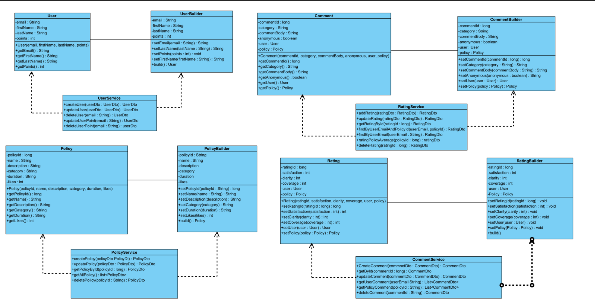
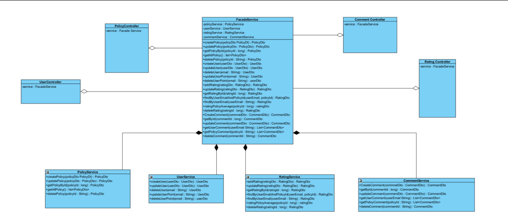
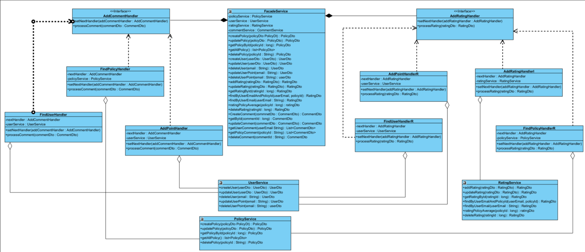

# iSure Customer Feedback and Rating System

## Table of Contents

- [Overview](#overview)
- [Features](#features)
- [Class Diagram for design Patterns](#class-diagrams)
  - [Builder Design Pattern](#builder-design-pattern)
  - [Facade Design Pattern](#facade-design-pattern)
  - [Chain of Responsibility Design Pattern](#chain-of-responsibility-design-pattern)
- [Acknowledgments](#acknowledgments)
- [Contact](#contact)

## Overview

This project is developed for the master's degree module 7045CEM Advanced Software Development. It implements a Customer Feedback and Rating System for iSure, an online insurance company. The system enables users to provide feedback and rate their experiences with various insurance policies, earning loyalty points in the process.

## Features

- **User Feedback and Rating:**
  Users can review different insurance policies, providing feedback on coverage, policy clarity, and overall satisfaction. Ratings and comments contribute to the user's loyalty points.

- **Points Management:**
  Users earn loyalty points for each comment and rating. Removing feedback results in the loss of earned points.

- **Server-Side Development:**
  The backend is developed using Java Spring Boot, providing REST APIs for each service and functionality.

- **Database:**
  MongoDB is used for data storage, ensuring a scalable and flexible database solution.

- **Test-Driven Development (TDD):**
  The project follows the Test-Driven Development approach. Requirements are written first, and then test units are developed using JUnit to ensure the functionality of each API.

- **Design Patterns:**
  Gang of Four (GoF) Design Patterns are implemented for maintaining code quality.
    - **Creational: Builder**
    - **Structural: Facade**
    - **Behavioral: Chain of Responsibility**

## Class Diagrams

### Builder Design Pattern
- **Explanation:**
  
The Builder Pattern is used in the creation of complex objects. In the context of this project, it is applied to construct intricate structures related to insurance policies, ensuring a clear and organized representation.

- **Diagram**

### Facade Design Pattern
- **Explanation:**

The Facade Pattern provides a unified interface to a set of interfaces in a subsystem, making it easier to use. In this project, it simplifies the interactions between different components, offering a more straightforward experience for developers and maintaining a clean architecture.

- **Diagram**

### Chain of Responsibility Design Pattern
- **Explanation:**

The Chain of Responsibility Pattern passes a request along a chain of handlers. In the context of this project, it is employed to handle various tasks related to feedback and ratings, creating a flexible and extensible system.

- **Diagram**

## Acknowledgments
- Gang of Four (GoF) Design Patterns
- Java Spring Boot
- MongoDB
- HTML CSS
- JavaScript
- JUnit

## Contact
For any inquiries, please contact Radman Lotfiazar at radman.lotfiazar@gmail.com.